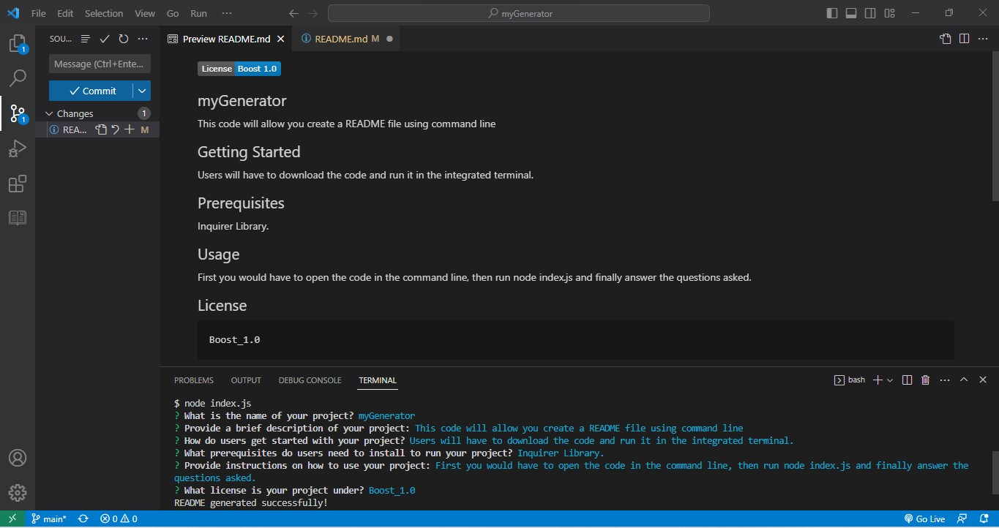

   
  
  ## Project Name: myGenerator

  ## Description
  This code will allow you create a README file using command line.
  
  ## Getting Started
  
  Users will have to download the code and run it in the integrated terminal.
  
  ## Prerequisites
  
  Inquirer Library.
  
  ## Usage
  
  First you would have to open the code in the command line, then run node index.js and finally answer the questions asked.   
  
  
  ## License
  
    Apache_2.0

  ## Screenshot
  